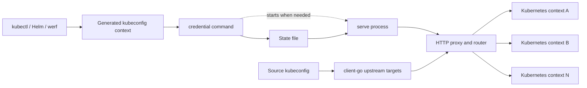

# Architecture

This document describes the architecture of `kubeconfig-proxy`, the boundaries
between its packages, and the design decisions that should remain explicit as
the project evolves.

The user-facing behavior and command reference live in [README.md](README.md).
This document is the source of truth for internal structure and architectural
constraints.

## Goals and constraints

`kubeconfig-proxy` presents several Kubernetes contexts through one generated
kubeconfig context. Its main responsibilities are:

- create and remove managed kubeconfig entries;
- start a local proxy on demand through Kubernetes exec credentials;
- authenticate and terminate TLS for local clients;
- build upstream clients from ordinary kubeconfig contexts;
- classify each Kubernetes API request and select its target contexts;
- aggregate list and watch responses without losing their source context.

The architecture is driven by several constraints:

- routing is the core product contract and must remain explicit;
- mutations across clusters are dangerous and must have predictable targets;
- source kubeconfig authentication must be delegated to `client-go`;
- secrets must stay in a local state file with restrictive permissions;
- long-running Kubernetes streams must not be buffered;
- the project ships as one small binary and does not need a framework or a
  public Go API.

This is not a Kubernetes federation control plane. There is no distributed
transaction, rollback, cache, reconciliation loop, or conflict resolution
between clusters. A multi-context mutation can partially succeed when one
upstream accepts the request and another fails.

## System overview



There are three distinct lifecycles:

1. Configuration: `add-context` selects source contexts, generates local
   credentials, saves state, and writes a managed kubeconfig context.
2. Activation: Kubernetes runs `credential`; it starts `serve` if necessary and
   returns an `ExecCredential` containing the local proxy bearer token.
3. Request handling: `serve` loads the state and source kubeconfig, constructs
   upstream targets, and delegates HTTP requests to `internal/proxy`.

## Repository layout

| Path | Responsibility | Must not own |
| --- | --- | --- |
| `cmd/kubeconfig-proxy` | CLI parsing, process lifecycle, local listener, TLS setup, readiness, idle shutdown, state reload, and composition of internal packages | Kubernetes routing policy or kubeconfig parsing rules |
| `internal/kubeconfig` | Loading source kubeconfigs, selecting and validating contexts, producing `rest.Config`, and writing/removing managed kubeconfig entries | HTTP proxy behavior or process management |
| `internal/upstream` | Converting selected kubeconfig contexts into concrete upstream targets with `client-go` transports | Request classification or response aggregation |
| `internal/state` | Versioned state schema, validation, duration parsing, and atomic persistence | Runtime networking or kubeconfig mutation |
| `internal/proxy` | Incoming authentication, routing decisions, upstream execution, mutation targeting, list/pagination/watch aggregation, and response handling | CLI flags, state-file I/O, or process lifecycle |
| `.codex/skills/test-kubeconfig-proxy` | Real-cluster integration validation using the two controlled kind clusters | Production runtime code |
| `examples` | Executable user examples | Shared production logic |

All production packages are under `internal` because the project does not
promise a reusable public Go API. The binary in `cmd/kubeconfig-proxy` is the
composition root.

### Dependency direction

Dependencies must remain acyclic and point toward lower-level capabilities:

```text
cmd/kubeconfig-proxy
  ├── internal/state
  ├── internal/kubeconfig
  ├── internal/upstream ──> internal/kubeconfig
  └── internal/proxy ─────> internal/upstream
```

`internal/upstream.Target` is the canonical runtime target type. The alias in
`internal/proxy` keeps routing code concise without creating a second target
model.

### Proxy file layout

`internal/proxy` is split by routing concern rather than by transport layer:

- `proxy.go` owns construction, invariants, and the top-level decision tree;
- `routing.go` contains small request-classification predicates;
- `forward.go` handles primary, named-object, and single streaming routes;
- `mutation.go` owns mutation target selection and request-body rewriting;
- `aggregate.go` merges ordinary lists and composite resource versions;
- `pagination.go` implements cross-context pagination;
- `watch.go` opens and merges watch streams;
- `upstream.go` owns buffered upstream calls, retries, and request construction;
- `auth.go`, `body.go`, `response.go`, and `target.go` provide narrow shared
  primitives.

New behavior should be added to the file that owns its routing concern. The
top-level decision tree should stay readable from top to bottom. Shared helpers
belong in a separate file only when they protect a real cross-cutting invariant
or remove actual duplication.

## Configuration lifecycle

### Adding a context

`add-context` performs the following steps:

1. Parse and validate CLI options.
2. Resolve absolute kubeconfig and state paths and choose a local listen
   address.
3. Load the source kubeconfig once through `internal/kubeconfig`.
4. Select contexts explicitly, by regular expression, or by the default rules.
5. Reject missing, repeated, or recursively selected proxy contexts.
6. Choose a required primary context.
7. Build upstream targets through `internal/upstream`.
8. Generate a bearer token and self-signed TLS key pair.
9. Atomically save the versioned state file.
10. Write the managed cluster, auth info, and context to the kubeconfig.

The generated kubeconfig contains the local HTTPS endpoint, public certificate
data, and an exec credential command. The bearer token and private key exist
only in the state file.

Safe context names retain their historical state filename. Unsafe or long names
use a sanitized readable prefix plus a short hash so distinct context names do
not collide.

### Exec credential and lazy startup

When a Kubernetes client uses the generated context, it runs:

```text
kubeconfig-proxy credential --state <path>
```

The credential command:

1. takes an exclusive `<state>.lock` file lock so concurrent clients do not
   start duplicate servers;
2. loads and validates the state;
3. checks the authenticated local readiness endpoint over TLS;
4. starts a detached `serve --state <path>` process when the endpoint is not
   ready;
5. waits for readiness and returns a Kubernetes `ExecCredential`.

For a non-zero proxy TTL, the credential expiration is derived from that TTL
with a safety skew. This lets Kubernetes refresh credentials and restart an
expired proxy without treating the serve process as a permanent daemon.

### Serve lifecycle and state reload

`serve` treats the state file as its runtime source of truth:

1. load and validate the profile;
2. parse duration strings once into a runtime profile;
3. load source contexts and construct upstream targets;
4. construct the proxy handler and TLS certificate;
5. listen on the configured address;
6. watch the state file for modification or removal.

When the state file changes, the current HTTP server shuts down gracefully and
the runtime is rebuilt from the new profile. Removing the state file stops the
server with an error. This keeps state reload explicit and avoids mutable global
configuration inside the proxy.

The activity wrapper tracks active proxied requests and last activity. The
readiness endpoint does not extend the idle TTL. A zero TTL disables idle
shutdown.

## Request routing contract

Authentication and read-only enforcement happen before request
classification. The routing order in `Proxy.ServeHTTP` is significant:

| Priority | Request class | Behavior |
| --- | --- | --- |
| 1 | Invalid bearer token | Reject with `401` |
| 2 | Mutation in read-only mode | Reject with `403` before any upstream call |
| 3 | Helm storage watch in Helm mode | Stream only from the primary target |
| 4 | Other watch | Open and merge streams from all targets |
| 5 | Pod `log`, `exec`, `attach`, or `portforward` | Find the context containing the pod and stream there; fall back to primary |
| 6 | Discovery, health, OpenAPI, or Helm storage list in Helm mode | Forward to primary |
| 7 | Named resource `GET` | Find the context containing the object; fall back to primary |
| 8 | Other non-watch `GET` | Aggregate lists from all targets |
| 9 | `POST`, `PUT`, `PATCH`, or `DELETE` | Select mutation targets and fan out |
| 10 | Any other request | Forward to primary |

The primary target is a deliberate compatibility boundary. Kubernetes
discovery is not merged, and Helm release storage can be forced to one linear
history while ordinary resources still use all selected contexts.

Routing predicates should remain small pure functions. Do not replace the
ordered decision tree with registration, reflection, or implicit middleware
rules.

## Reads, lists, pagination, and watches

Ordinary list calls are made to all targets concurrently. A failed transport or
non-success response from any target fails the aggregate request; partial list
results are not returned.

For Kubernetes list objects and `Table` responses, each item is marked with:

- annotation `kubeconfig-proxy.io/context`;
- virtual label `context`.

The proxy encodes per-target Kubernetes resource versions into one opaque
aggregate resource version. A later watch decodes it and sends each target only
its own resource version.

Watch streams are opened concurrently and copied to the client as events
arrive. Event writes are serialized, but ordering between clusters is
intentionally not defined. Named-field-selector watches first issue list
requests so an empty selection can return without opening unnecessary streams.

### Cross-context pagination

Kubernetes continuation tokens are local to one API server and cannot be sent
to another cluster. Therefore paginated aggregation is sequential even though
ordinary list aggregation is concurrent.

The proxy enforces one global `limit` and returns an opaque continuation token
containing:

- the configured target names;
- the current target;
- that target's upstream continuation token;
- the request path and query scope, excluding `limit` and `continue`;
- resource versions accumulated from completed pages.

The token is rejected if the target set or request scope changes. This prevents
mixing target-local tokens, selectors, or paths across pages. Callers must treat
both aggregate resource versions and continuation tokens as opaque values.

## Mutations

Mutation routing is intentionally explicit:

1. `kubeconfig-proxy.io/context-name` selects exactly the named configured
   context.
2. Otherwise `kubeconfig-proxy.io/single-context: "true"` selects the
   alphabetically first configured context.
3. Without either annotation, the request targets every configured context.

For named `PATCH` and `DELETE`, the body may not contain annotations. The proxy
looks up the existing object and uses its annotations or the set of contexts in
which the object exists.

Before a `PUT`, each target may be queried for the current object. The proxy
preserves that target's `uid` and `resourceVersion` in the outgoing body so one
cluster's identity is never copied to another cluster.

Fan-out calls run concurrently. There is no rollback: tests must verify which
targets were contacted, not only the final status returned to the client.

## Upstream transport and resource limits

Upstream targets are built from `client-go` `rest.Config` values. This preserves
the authentication plugins, certificates, proxies, and other transport behavior
already supported by kubeconfig and `client-go`.

The incoming local bearer token is removed before forwarding. The upstream
transport applies the source context's own credentials. `Accept-Encoding` is
also removed from manually constructed buffered requests so the Go transport
can manage response decompression consistently.

Buffered upstream calls have a configurable request timeout and retry temporary
transport failures plus HTTP `429`, `500`, `502`, `503`, and `504`. Long-running
requests use streaming reverse-proxy or watch paths. A watch uses the request
timeout only while opening its upstream stream; successful stream lifetimes are
not bounded by the ordinary request timeout.

Memory is bounded for buffered traffic:

- mutation request bodies: 16 MiB;
- non-streaming upstream responses and watch-open error bodies: 64 MiB.

These limits do not apply to successful long-running streams because those
bodies are copied incrementally.

## State and security boundaries

The state schema is versioned. Existing field names are compatibility
contracts; incompatible schema changes require an explicit versioning and
migration decision.

State persistence uses a temporary file followed by rename. State files and
managed kubeconfig files use mode `0600`; their parent directories use mode
`0700` when created. The state contains sensitive bearer-token and TLS private
key material and must never be logged.

The local server:

- requires bearer authentication for readiness and proxy requests;
- serves HTTPS with TLS 1.2 or newer;
- uses the generated certificate recorded in kubeconfig and state;
- defaults to a loopback listen address.

Binding to a non-loopback address is an explicit user choice and expands the
trust boundary.

## Architectural decisions

### One binary, several commands

Configuration, exec credential, and serving behavior share one binary so the
generated kubeconfig does not depend on a separately managed daemon. Command
code remains in one `main` package, while reusable domain behavior stays in
small `internal` packages.

### File-backed runtime state

A local state file is simpler to inspect, secure, version, and regenerate than
a background service registry. Atomic writes and state-driven restarts avoid
partially mutating live runtime objects.

### Concrete types over framework abstractions

The project has one state backend, one kubeconfig loader, and one HTTP runtime.
Concrete types, `http.Handler`, `http.RoundTripper`, and `httptest` provide the
required seams. Introduce an interface only when multiple real implementations
or a security boundary justify it.

### Explicit primary target

Some Kubernetes APIs cannot be meaningfully merged. Requiring a primary target
makes the fallback deterministic and keeps discovery and Helm compatibility
predictable.

### Explicit routing over generic fan-out middleware

Request classes have different safety, buffering, lookup, and streaming rules.
Keeping those branches visible in `ServeHTTP` is preferred to a generic
pipeline whose target selection is difficult to audit.

### Parallel aggregation, sequential pagination

Unpaginated list and fan-out mutation calls are independent and run
concurrently. Pagination must preserve a global limit while advancing
cluster-local cursors, so it visits targets sequentially.

### Fail aggregate requests instead of hiding target errors

Returning an apparently complete aggregate while silently omitting a failed
cluster would be misleading. Aggregate reads and mutations report upstream
failures, while source context names are included in diagnostic errors.

## Change checklist

When changing the architecture:

- keep package dependencies in the documented direction;
- update this file when package ownership, layout, lifecycle, state schema,
  security boundaries, or routing responsibilities change;
- preserve the visible ordering of routing decisions;
- add unit tests for classification and exact target selection;
- update the integration skill for user-visible Kubernetes behavior;
- update `README.md` for user-facing commands, flags, annotations, or limits;
- run the smallest relevant tests and then `make check`.
