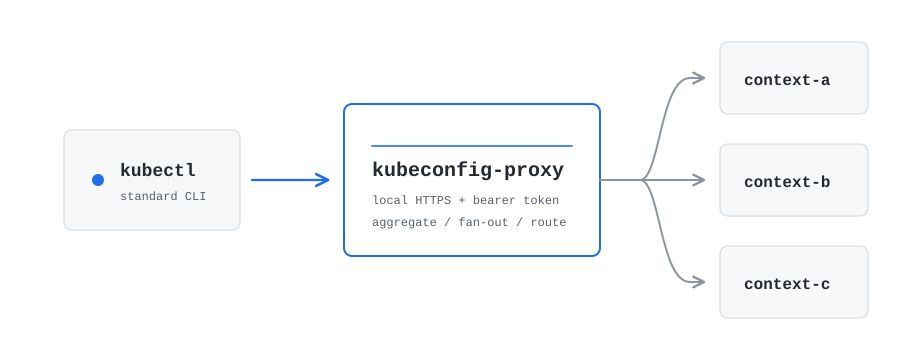

# kubeconfig-proxy

[](https://codecov.io/gh/IMMORTALxJO/kubeconfig-proxy)
[](https://app.deepsource.com/gh/IMMORTALxJO/kubeconfig-proxy/)



`kubeconfig-proxy` is a local Kubernetes API proxy that adds an auto-started
proxy context to your kubeconfig. That context can work with several source
kubeconfig contexts at the same time.

It is useful when you want to run ordinary Kubernetes tools against a group of
clusters as if they were one logical target:

- inspect resources from multiple clusters in one `kubectl get`;
- create or update the same resource in every selected cluster;
- route selected resources to one specific cluster with annotations;
- deploy simple Helm/werf projects through one proxy context.

The proxy context is backed by a local state file and a Kubernetes exec
credential plugin. The local proxy uses HTTPS and bearer-token authentication.


## Installation

Install the latest released CLI:

```bash
curl -fsSL https://raw.githubusercontent.com/IMMORTALxJO/kubeconfig-proxy/master/install.sh | sh
```

The installer downloads the latest GitHub Release for your OS and architecture,
verifies it with `checksums.txt`, and installs `kubeconfig-proxy` to
`/usr/local/bin`. To install a specific version or use another directory:

```bash
curl -fsSL https://raw.githubusercontent.com/IMMORTALxJO/kubeconfig-proxy/master/install.sh | KUBECONFIG_PROXY_VERSION=v0.0.5 INSTALL_DIR="$HOME/.local/bin" sh
```

## Quick Start

Add `proxy-context` to your kubeconfig:

```bash
kubeconfig-proxy add-context proxy-context \
  --contexts prod-a,prod-b
```

> To block mutating requests, add `--read-only`.

Work through the proxy context:

```bash
kubectl get pods -A -L kcp-context --context proxy-context
```

If you no longer need it, remove the managed kubeconfig entries:

```bash
kubeconfig-proxy delete-context proxy-context
```

## How It Works

The proxy keeps a list of source contexts from the original kubeconfig. Requests
made through the proxy context are routed according to request type:

The complete request matrix, including target selection, concurrency, and
failure semantics, is in [ROUTING.md](ROUTING.md).

- list requests are aggregated from all selected contexts;
- paginated lists honor one global `limit` and use an opaque proxy continuation
  token to advance across contexts without duplicates or omissions; every
  continuation request must include a positive `limit`;
- ordinary collection watches are streamed from all selected contexts; named
  watches use only contexts where the object exists;
- create, update, patch, and delete requests are sent to all selected contexts
  unless routing annotations or an existing object select specific targets;
- discovery requests use the primary context;
- named pod subresources such as `logs`, `exec`, `attach`, and `port-forward`
  are routed to the context that contains the pod;
- resources can opt into single-context mutation with annotations;
- read-only proxy contexts reject mutating requests with `403 Forbidden`.

Aggregated objects are marked with:

```yaml
kubeconfig-proxy.io/source-context: <source-context>
```

The proxy also injects a virtual `kcp-context` label into aggregated responses, so
you can display the source cluster directly:

```bash
kubectl get pods -A -L kcp-context
```

For a named `GET`, the label contains a comma-separated list of every source
context where the object exists.

## Proxy Context Lifecycle

The generated `prod-proxy` context points to a local HTTPS endpoint and uses a
kubeconfig exec credential command. When `kubectl` uses that context, it runs
`kubeconfig-proxy credential --state <path>`. The credential command starts
`kubeconfig-proxy serve --state <path>` automatically if the proxy is not
already running, waits for readiness, and returns the bearer token expected by
the local proxy.

The state file defaults to:

```text
~/.kube/kubeconfig-proxy/<context-name>.yaml
```

Context names containing path separators or other filename-unsafe characters
use a readable sanitized prefix plus a short hash. This keeps names such as
`prod/blue` and `prod_blue` on distinct state paths.

It is written with file mode `0600` and contains the proxy's private TLS key,
certificate, bearer token, selected source contexts, primary context, listen
address, and runtime options. The kubeconfig stores only the public proxy server
URL, certificate authority data, and exec command.

`--proxy-ttl` controls idle shutdown. If no proxied Kubernetes API requests are
active for that duration, the auto-started proxy process exits by itself. Health
checks made by the credential command do not extend the TTL. Set `--proxy-ttl 0`
to disable idle shutdown.

Serve logs are disabled by default. Pass `--logs-enabled` to `add-context` to
write auto-started `serve` output to `<state>.log`.

## Selecting Source Contexts

You can also select source contexts with a regular expression:

```bash
kubeconfig-proxy add-context prod-proxy \
  --kubeconfig ~/.kube/config \
  --context-regexp '^prod-' \
  --primary-context prod-a
```

The CLI reads and updates one kubeconfig file. `--kubeconfig` selects it
explicitly. When the flag is omitted, the first existing file from the ordinary
Kubernetes precedence list is selected: entries in `KUBECONFIG` are considered
from left to right, or `~/.kube/config` is used when the environment variable is
unset. Multiple `KUBECONFIG` files are not merged.

If `--contexts` is omitted, all contexts from the selected file are used. If
`--primary-context` is omitted, that file's current context is used; when there
is no current context, the first selected context is used.

## Resource Routing Annotations

By default, mutating requests are sent to every selected context. To direct a
mutation to one or more specific source contexts, add:

```yaml
metadata:
  annotations:
    kubeconfig-proxy.io/target-context: dev, prod
```

Context names in the request body are comma-separated; surrounding whitespace
is ignored and a repeated name is sent only once. An unknown or empty name
causes a local `400` without any upstream call.

`kubeconfig-proxy.io/source-context` on aggregated objects is a source-context marker
only; it does not affect mutation routing.

The proxy removes the virtual `kcp-context` label from ordinary manifest bodies
sent with `POST` or `PUT`, so an object returned by the proxy can be used as a
manifest without sending proxy-only metadata upstream. `PATCH` bodies are
forwarded unchanged.

To create or update a resource in any single context, add:

```yaml
metadata:
  annotations:
    kubeconfig-proxy.io/single-context: "true"
```

The selected context for `single-context` is the primary context. If both
routing annotations are present, `kubeconfig-proxy.io/target-context` wins.

## Helm And Werf

Helm and werf store release history in Kubernetes Secrets or ConfigMaps and
expect that history to be a single linear stream. If the proxy returns the same
release record from several clusters, their release planner can fail.

Use `--helm-release-proxy` when deploying Helm/werf projects through the proxy:

```bash
kubeconfig-proxy add-context dev-stage-proxy \
  --kubeconfig ~/.kube/config \
  --contexts dev,stage \
  --primary-context dev \
  --helm-release-proxy
```

With this mode enabled, matching Secret and ConfigMap list/watch requests are
read only from the primary context, while ordinary application resources are
still fanned out to all selected contexts. A request matches when its decoded
`labelSelector` contains the literal text `owner=helm` or `owner==helm`.

See [examples/werf/README.md](examples/werf/README.md) for a complete local
werf example.

## Commands And Flags

- `add-context <name>` adds an auto-started proxy context to a kubeconfig.
- `--kubeconfig ~/.kube/config` selects the single source kubeconfig file to
  read and update. If omitted, the first file in the normal Kubernetes
  precedence list is selected; multiple `KUBECONFIG` files are not merged.
- `--state /path/to/proxy.yaml` overrides the generated state file path.
- `--contexts dev,stage,prod` limits the proxy to specific source contexts.
  Repeating a context name is rejected so mutations cannot be sent to the same
  cluster twice.
- `--context-regexp '^prod-'` selects source contexts by regular expression.
- `--primary-context dev` selects the context used for discovery and other
  primary-only operations.
- `--listen 127.0.0.1:9443` sets the proxy listen address.
- `--proxy-ttl 10m` sets the auto-started proxy idle lifetime. Use `0` to
  disable idle shutdown.
- `--request-timeout 30s` sets the timeout for one upstream Kubernetes API
  request. Use `0` to disable it.
- `--retries 5` retries temporary upstream failures.
- `--retry-backoff 200ms` sets the delay between retry attempts.
- `--helm-release-proxy` enables Helm/werf release-history compatibility mode.
- `--read-only` rejects create, update, patch, and delete requests with `403`.
- `--logs-enabled` writes auto-started `serve` output to `<state>.log`.
- `--exec-command /path/to/kubeconfig-proxy` overrides the command stored in
  kubeconfig exec authentication.
- `delete-context <name>` removes the generated kubeconfig context, cluster,
  auth info, state file, and log file. An existing `<state>.lock`
  synchronization file is retained.
- `delete-context <name> --state <path>` removes an additional explicit state
  and log file when no managed kubeconfig entry records that path.
- `credential --state <path>` is the kubeconfig exec credential entrypoint.
- `serve --state <path>` runs a state-backed proxy process.
- `version` prints the CLI version. Local builds print `dev`; release
  builds print the release tag.

Retries default to `5`. Set `--retries 0` to disable them. The proxy retries
network errors and temporary upstream HTTP responses: `429`, `500`, `502`,
`503`, and `504`.

## Security

The proxy uses the credentials from the source kubeconfig to talk to the source
clusters. Protect the listen address accordingly.

To keep a local client or upstream from exhausting proxy memory, mutating
request bodies are limited to 16 MiB and buffered non-streaming upstream
responses are limited to 64 MiB.

When a context is added, the proxy generates:

- a bearer token required by every incoming request;
- a self-signed TLS certificate and private key for the local proxy.

The state file is written with file mode `0600` and contains the bearer token
and TLS private key. Keep the proxy bound to `127.0.0.1` unless you
intentionally want to expose it to a trusted network.

## Local Examples

- [examples/kind.md](examples/kind.md) shows how to test the proxy with two
  local kind clusters.
- [examples/werf/README.md](examples/werf/README.md) shows how to deploy a
  simple nginx chart and a single-context Job through werf.

## Development

Run tests:

```bash
make test
make race
```

Build the binary:

```bash
make build
```

Run the comprehensive local check suite (a superset of the checks run by CI):

```bash
make check
```

The two-cluster checks are grouped by behavior under `e2e/checks/` and sourced
by `e2e/run.sh`. Keep routing assertions there so each run uses the runner's
temporary kubeconfig, coverage-instrumented proxy, structured result table,
and cleanup.

The e2e runner reuses the `kubeconfig-proxy-a` and `kubeconfig-proxy-b` kind
clusters. Each run derives a DNS-safe prefix from `KCP_E2E_BRANCH` (or the local
Git branch) and uses it in every test resource name and namespace, so different
branches can test in parallel without sharing resources. Set `KCP_E2E_PREFIX`
to explicitly select a prefix; it must be a lowercase DNS label no longer than
32 characters.

Run e2e suites through Make:

```bash
make e2e          # all suites: kind, then upstream kubectl
make e2e local    # built-in kind checks, without make check or werf
make e2e kind     # two-cluster kind integration suite
make e2e kubectl  # upstream kubectl compatibility suite
```

To run the two-cluster kind e2e suite for a pull request from GitHub Actions,
comment `/e2e` on that PR. To run the separate upstream Kubernetes `kubectl`
suite, comment `/e2e-upstream-kubectl`. Both commands are available to
repository owners, members, and collaborators; they check out the current PR
head. A newer matching command cancels a running job for the same PR and starts
a fresh one. The kind job runs for up to 45 minutes and skips the optional
`werf` check; the upstream job can run for up to six hours. Follow them in the
[kind e2e workflow](https://github.com/IMMORTALxJO/kubeconfig-proxy/actions/workflows/pr-e2e-command.yml)
and [upstream kubectl workflow](https://github.com/IMMORTALxJO/kubeconfig-proxy/actions/workflows/pr-upstream-kubectl-e2e-command.yml).

Run the upstream Kubernetes `kubectl` e2e compatibility suite through a
single-source proxy context:

```bash
e2e/run-upstream-kubectl-e2e.sh
```

The runner builds the pinned Kubernetes source and can take a long time. It is
intended for host-side proxy kubeconfig compatibility; upstream's direct
in-cluster-config scenario is excluded by default. It builds one
coverage-instrumented `bin/kubeconfig-proxy` before e2e, enables proxy serve
logging, and writes the final HTML coverage report to
`.codex/reports/coverage.html` after cleanup. It is separate from the two-cluster
integration runner because the upstream e2e suite
expects one coherent Kubernetes API server; multi-cluster aggregation and
fan-out remain covered by the project integration tests.

## Kubernetes Compatibility

[](https://github.com/IMMORTALxJO/kubeconfig-proxy/actions/workflows/compatibility.yml)

The supported compatibility window is the current three active Kubernetes and
kubectl minor versions. The compatibility workflow verifies every
Kubernetes-supported combination of kubectl, primary cluster, and secondary
cluster, then runs the upstream `[sig-cli] Kubectl client` suite for each
minor version. The exact tested images, patch versions, scope, latest workflow
result, and commands for running an individual cell are in
[COMPATIBILITY.md](COMPATIBILITY.md).

Release builds are produced by GitHub Actions when a `v*` tag is pushed. The
release workflow injects that tag into `kubeconfig-proxy version`.

## License

Apache License 2.0. See [LICENSE](LICENSE).
